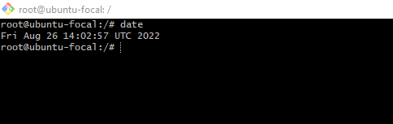
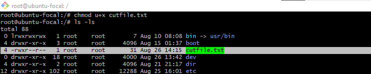
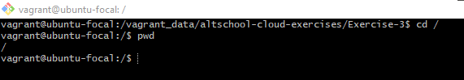

## **10 LINUX COMMAND**

# What is a Linux command?

Linux is a family of open-source Unix-like operating systems based on the Linux kernel. The Linux command is a utility of the Linux operating system. All basic and advanced tasks can be done by executing commands. The commands are executed on the Linux terminal. The terminal is a command-line interface to interact with the system, which is similar to the command prompt in the Windows OS. Commands in Linux are case-sensitive.

## Linux system management Command

1. systemctl Command

The systemctl command is a utility which is responsible for examining and controlling the systemd system and service manager. It is a collection of system management libraries, utilities and daemons which function as a successor to the System V init daemon. The new systemctl commands have proven quite useful in managing a servers services

_syntax_

$ systemctl status apache2

_output_

## Linux I/O Redirection

2. < > Command

Redirection can be defined as changing the way from where commands read input to where commands sends output. You can redirect input and output of a command.
For redirection, meta characters are used. Redirection can be into a file (shell meta characters are angle brackets '<', '>') or a program ( shell meta characters are pipesymbol '|').

_syntax_

$ ls > text.txt

_output_

## Linux Shell Commands

3. type Command

Linux 'type' command tell us whether a command given to the shell is a built-in or external command.

_syntax_

$ type ls

_output_

## Basic Unix Tools

4. date Command

The date command is basic utility, and it can be used by executing without any argument. It will display the current date and time. Consider the below command

_syntax_

$ date

_output_

## Linux Filters

5. cut Command

Linux cut command is useful for selecting a specific column of a file. It is used to cut a specific sections by byte position, character, and field and writes them to standard output. It cuts a line and extracts the text data. It is necessary to pass an argument with it; otherwise, it will throw an error message. To cut a specific section, it is necessary to specify the delimiter. A delimiter will decide how the sections are separated in a text file. Delimiters can be a space (' '), a hyphen (-), a slash (/), or anything else. After '-f' option, the column number is mentioned.

_syntax_

$ cut -d- -f2 cutfile.txt

_output_

## Linux File Ownership

6. chmod Command

Command chown is used to change the owner of the file.

_syntax_

$ chmod u+x file-1

_output_

## Linux Filesystem Hierarchy Standard (FHS)

7. The Root Directory Command

All the directories in the Linux system comes under the root directory which is represented by a forward slash (/). Everything in your system can be found under this root directory even if they are stored in different virtual or physical devices.

_syntax_

$ cd /

_output_

## Linux System Admin Command

8. who Command

Same as w but doesn't show current process

_syntax_

$ whoami

_output_

9. su Command

Switch from one to another user

_syntax_

$ sudo su

_output_

10. users Command

Show current logged in users

_syntax_

$ users

_output_

## THE END
