## **ALTSCHOOL AFRICA**

## **Mini Project (Exercise 11)**

We will be deploying a real life application:

- Demo Project: https://github.com/michaelagbiaowei/laravel-realworld-example-app.git

- Setup Debain 11 on a virtual machine instance with a cloud provider or as instructed

- Setup Apache2 with every dependency the application needs to run

- Don't use Laravel Sail or Docker as suggested in the project README.md file, simply clone the project with Git and deploy with apache2

- Setup MySQL with credentials and a database for your application to use

- Configure a subdomain if you have a domain name to point to the Vm instance or speak to an instructor for futher guide

- You have complete the project if you are able to view the application according to the specifications in the project from your Host browser

## **Getting Started**

## **Step One:**

We will be using Debain 11 on a virtual machine instance with Amazon Web Services (AWS) as our VPC provider.

**NOTE:** Your Amazon Elastic Compute Cloud (Amazon EC2) instance Inbound Rules should be configured to allow port **22** for SSH and 0 - 65535 for All TCP

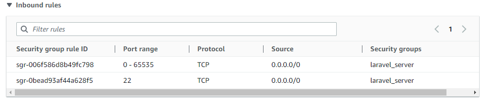

## **Step two:**

## **Install git dependencies**

Update the Package Installer

    $ sudo apt update && sudo apt upgrade -y

**When prompt, keep the local version currently installed and Hit the Enter Key**

This command will help to download & install Git directly at the AWS server. First, it will download the Git & then it will start installing on the server.

    $ sudo apt install git -y

After installation is completed, the below command will prompt the installed version of Git in the AWS server. Hence, the installation is completed

    $ git --version

## **Step Three**

## **Install Apache2**

Apache Webserver is the **A** in the **LAMP** stack. We can run the following command

This will install the Apache webserver package and start the Apache web service automatically

    $ sudo apt install apache2

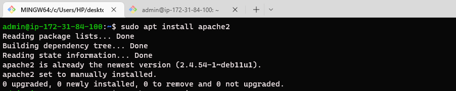

Next, Confirm that the Apache2 Service is Started and Enabled

    $ sudo apache2 -v

    $ sudo systemctl enable apache2

    $ sudo systemctl start apache2

    $ sudo systemctl status apache2

## **Step Four**

## **Clone Laravel Repository**

Chance directory to **/var/www/html**

    $ cd /var/www/html

Next we will clone the Laravel Project int the present working direcctory

    $ sudo git clone https://github.com/michaelagbiaowei/laravel-realworld-example-app.git

Lastly, change directory into the Laravel Project

    $ cd /var/www/html/laravel-realworld-example-app

## **Step Five**

## **Installation of PHP**

## **Add Sury PHP repo**

The packages to install PHP 8.1 on Debian 11 are not available in the default base repository, hence we have to add the SURY repository manually. The below given is a single command, **COPY THE ENTIRE COMMAND AT ONCE** and paste it in your terminal. And hit the Enter key

    $ echo "deb https://packages.sury.org/php/ $(lsb_release -sc) main"\
          | sudo tee /etc/apt/sources.list.d/sury-php.list

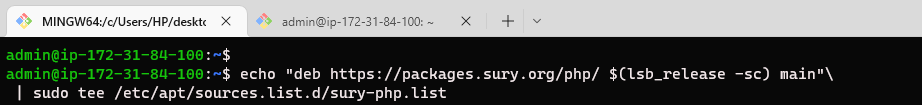

    $ sudo apt install gnupg gnupg2

## **Import GPG Key on Debian**

The system needs to verify the packages we receive to install PHP 8.0 from the Sury repository, to confirm they have not been altered by anyone

    $ wget -qO - https://packages.sury.org/php/apt.gpg | sudo apt-key add -

## **Run system update**

    $ sudo apt update && sudo apt upgrade -y

## **Install php**

We can go for the installation of php and the required extensions as per your web application requirements.

    $ sudo apt-get install php8.1 libapache2-mod-php php8.1-dev php8.1-zip php8.1-curl php8.1-mbstring php8.1-mysql php8.1-gd php8.1-xml

**if error occurs...   Confirm your PUBLIC_KEY from your ERROR MESSEGAE and ...run**

        $ sudo gpg --keyserver pgpkeys.mit.edu --recv-key B188E2B695BD4743

        $ sudo wget -qO - https://packages.sury.org/php/apt.gpg | sudo apt-key add -
        
    Re-run the php installation command
        
        $ sudo apt-get install php8.1 libapache2-mod-php php8.1-dev php8.1-zip php8.1-curl php8.1-mbstring php8.1-mysql php8.1-gd php8.1-xml

- php8.1-cli - command interpreter, useful for testing PHP scripts from a shell or performing general shell scripting tasks
- php8.1-common - documentation, examples, and common modules for PHP

- php8.1-mysql - for working with MySQL databases

- php8.1-zip - for working with compressed files
- php8.1-gd - for working with images

- php8.1-mbstring - used to manage non-ASCII strings

- php8.1-curl - lets you make HTTP requests in PHP

- php8.1-xml - for working with XML data

- php8.1-bcmath - used when working with precision floats

<a href="https://www.digitalocean.com/community/tutorials/how-to-install-php-8-1-and-set-up-a-local-development-environment-on-ubuntu-22-04">
   Source
</a>

    $ php -v

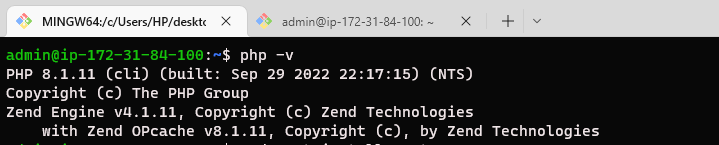

## **Step Six**

## **Install MySQL**

## **Download MySQL repository Debian package**

Configuration of MySQL repsotiory on Debian and on its <a href="https://dev.mysql.com/downloads/repo/apt/">Offical Community Download Page</a> and there you will get the latest Apt repsotiory in the deb binary form to download. You can also use the given commands instead

    $ sudo apt install wget -y

    $ sudo wget https://dev.mysql.com/get/mysql-apt-config_0.8.20-1_all.deb

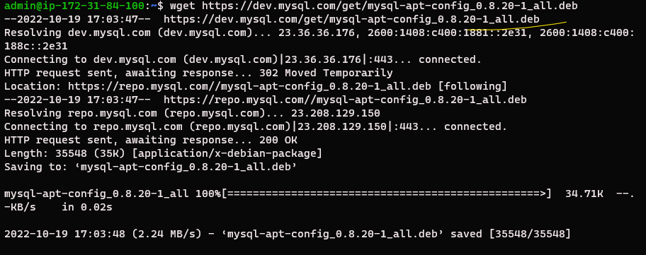

    $ sudo apt install ./mysql-apt-config_*_all.deb

    $ sudo apt update && sudo apt upgrade

**if error occurs... Confirm your PUBLIC_KEY from your ERROR MESSEGAE ...and run the following commands**

    $ sudo apt-key adv --keyserver pgp.mit.edu --recv-keys 467B942D3A79BD29

    $ sudo apt update && sudo apt upgrade -y

You will get option to select for what you want to add via the repository. Use the Arrow key, select **MySQL** Server & Cluster , then press the **TAB button** to select **OK** and hit then the **Enter key**

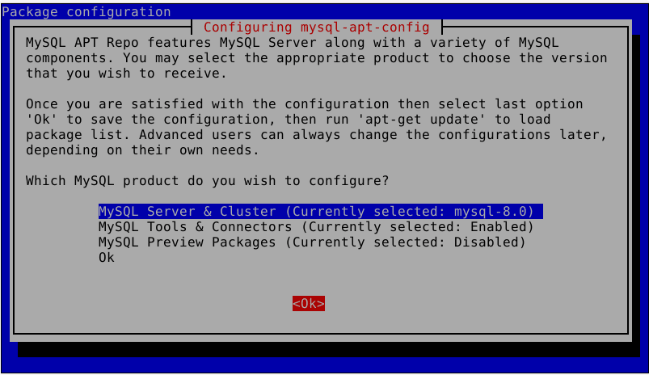

Select the available version of MySQL Server, here in our case it was myslq-8.0. After that use the **TAB** to select _OK_ and hit the **Enter key**

Again Select OK and then use the TAB to move to OK and hit the Enter key

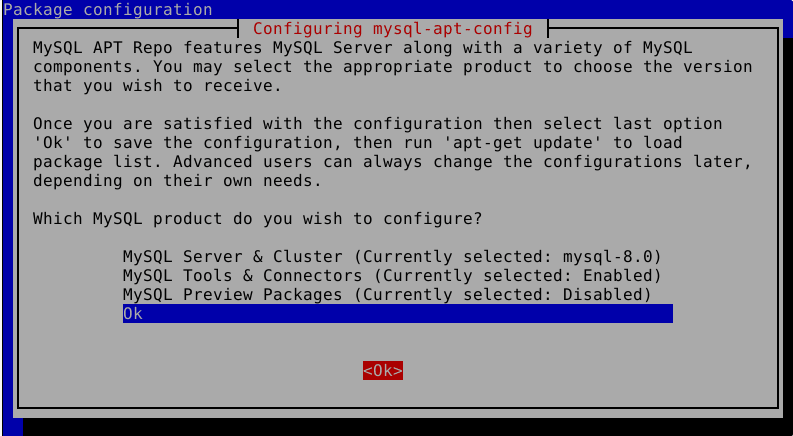

## **Installation of MySQL-Server**

During the installation process, it will prompt us to SET A PASSWORD FOR THE ROOT USER, make sure to enter a strong password and Hit the **ENTER KEY**

Next it the again prompt us to re-enter our password, after this has been done, Hit the **ENTER KEY** again to exit

    $ sudo apt install mysql-server

    $ mysql --version

    $ sudo systemctl enable --now mysql

    $ sudo systemctl status mysql

    $ sudo mysql_secure_installation

**Input the password you setup during the Installation of MySQL**

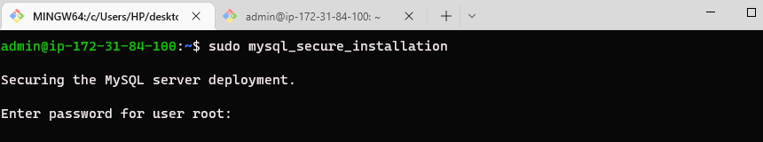

Depending on your version it might prompt you to install the VALIDATE PASSWORD plugin. This is not necessary since we will have control over making new users and we will make sure the passwords are secure enough, so we will skip over this setting. **(Type ‘N’)**.

Next, it will prompt us if we want to change the existing password for the root user. If you had set a secure password in the last step then you can also skip this question by pressing any key **(other than ‘Y’)**. If you left the password blank or set up a random password (like ‘password’ or ‘1234’) then go ahead and change your password now. You can generate a password here if you used a password that is not strong.

It will then prompt us to remove an anonymous user. **Type Y** to remove the anonymous users

Now it will prompt if we want to Disallow root login remotely and you should also select **Y**

Another prompt will asks to Remove the test database and access it. This is a good idea to do, so type **Y** for this.

It may also prompt to reload privilege tables now This is always a good idea, so type **Y**

## **Step Seven**

## **Configure Apache2**

We will create an Apache virtual host configuration file to host our Laravel application.

    $ sudo nano /etc/apache2/sites-available/laravel.conf

We then need to add the following context into the Laravel Configuration host file:

    <VirtualHost *:80>

        ServerAdmin admin@example.com

        ServerName mydomain.com

        DocumentRoot /var/www/html/laravel-realworld-example-app/public

        <Directory /var/www/html/laravel-realworld-example-app>

        Options Indexes MultiViews

        AllowOverride None

        Require all granted

        </Directory>

        ErrorLog ${APACHE_LOG_DIR}/error.log

        CustomLog ${APACHE_LOG_DIR}/access.log combined

    </VirtualHost>

We can now save and close the file and then enable the Apache rewrite module and activate the Laravel virtual host

    $ sudo a2enmod rewrite

    $ sudo a2ensite laravel.conf

Reload the Apache service to apply the changes

    $ sudo systemctl restart apache2

## **Step Eight**

## **Configuring php**

In your terminal, open the php.ini file with nano

    $ sudo nano /etc/php/8.1/apache2/php.ini

The line we need to edit is **cgi.fix_pathinfo=0** so you can either search for it manually, or you can search for it using **Ctrl+W**

Press Ctrl+W and now type in **cgi.fix_pathinfo** and click enter. This will take you to the right line. You will see a semicolon on the left of this line. Delete the semicolon and then change the value from 1 to a 0 and save the file.

To save something in Nano, just press **Ctrl+X** and **type Y** and then press Enter

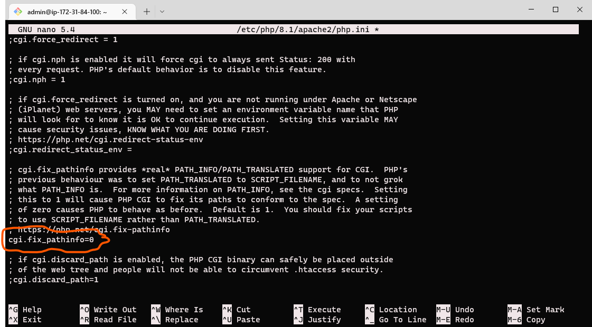

Restart the Apache service to apply changes

    $ sudo systemctl restart apache2

## **Step Nine**

## **Setting Up Composer for Dependency Management**

Composer is a PHP dependency manager that manages the dependencies and libraries that PHP applications require. We will need it to install the Laravel dependencies and packages.

Run the following commands to install Composer

To install Composer, download the installer first with the following curl command

    $ curl -sS https://getcomposer.org/installer -o /tmp/composer-setup.php

To facilitate the verification step, you can use the following command to programmatically obtain the latest hash from the Composer page and store it in a shell variable

    $ HASH=`curl -sS https://composer.github.io/installer.sig`

To verify the obtained value, you can run

    $ echo $HASH

Now execute the following PHP code, as provided in the Composer download page, to verify that the installation script is safe to run

    $ php -r "if (hash_file('SHA384', '/tmp/composer-setup.php') === '$HASH') { echo 'Installer verified'; } else { echo 'Installer corrupt'; unlink('composer-setup.php'); } echo PHP_EOL;"

If the output says Installer corrupt, you’ll need to download the installation script again and double check that you’re using the correct hash. Then, repeat the verification process. When you have a verified installer, you can continue.

To install composer globally, use the following command which will download and install Composer as a system-wide command named composer, under /usr/local/bin

    $ sudo php /tmp/composer-setup.php --install-dir=/usr/local/bin --filename=composer

To test your installation, with the given command

    $ composer

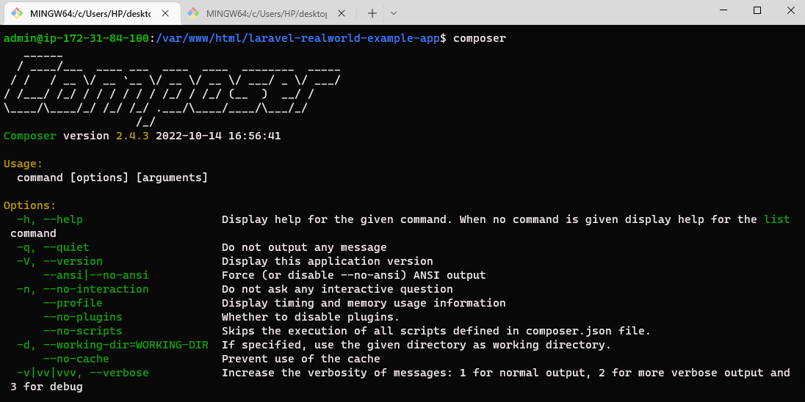

## **Step Ten**

## **Run Composer**

We can use composer to install the laravel dependencies

We use the –no-dev flag to install only the dependencies that are required in production

    $ sudo composer install --no-dev

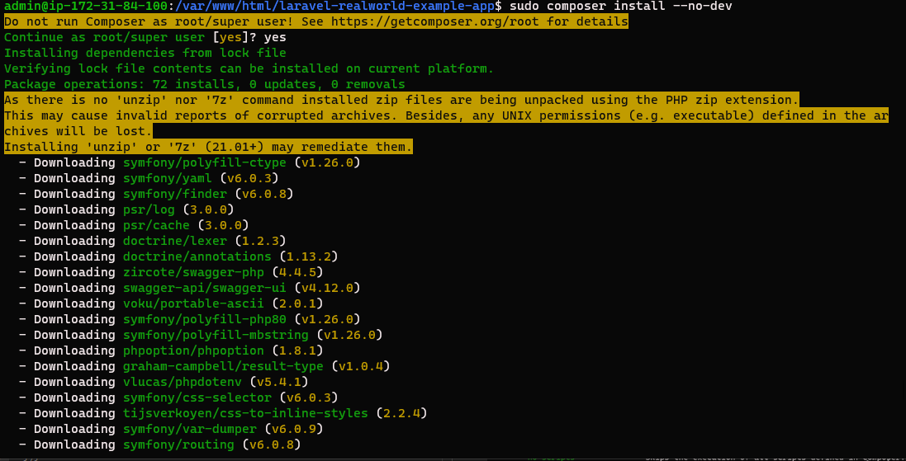

## **Step Eleven**

## **Laravel Permissions**

In order to run, Apache needs certain permissions over the Laravel directory we made. We must first give our web group control of the Laravel-realworld-example-app directory

    $ sudo chown -R :www-data /var/www/html/laravel-realworld-example-app

    $ sudo chmod -R 775 /var/www/html/laravel-realworld-example-app

    $ sudo chmod -R 775 /var/www/html/laravel-realworld-example-app/storage

    $ sudo chmod -R 775 /var/www/html/laravel-realworld-example-app/bootstrap/cache

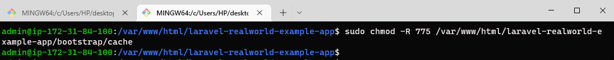

## **Step Twelve**

## **Confugring .env file**

We can finish the Laravel installation by running the following commands

    $ sudo cp .env.example .env

    $ sudo php artisan key:generate

## **Step Thirteen**

## **Database Setup**

We can now create a database to store our application data in it. We can set up the database that our application will be using in production.

Let’s start by executing the following command into MySQL

    $ mysql -u root -p

Copy and paste the following context

    CREATE DATABASE laraveldatabase;

## **Step Fourteen**

## **Configuring Laravel**

We can start by adding the database credentials to the **.env** file we had generated earlier. This file contains all the application variables that need to be kept secret

**NOTE::: APP_KEY=base64 should be left untouched**

    $ sudo nano .env

We can also set the APP_ENV Key to production since our application is in production and also turn the APP_DEBUG key to false. This ensures that no debug and stack trace messages are displayed to the general public

We have to uncomment our web.php context in other to migrate our data

    $ sudo nano routes/web.php

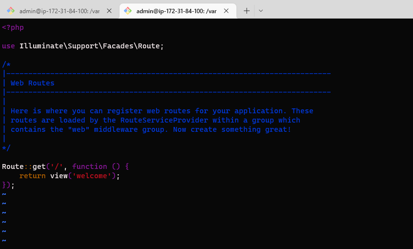

We can now cache our configurations using the command

    $ sudo php artisan config:cache

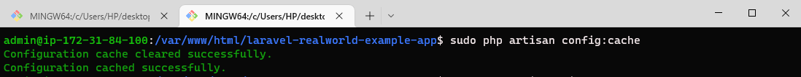

Disable default Apache2 configuration

    $ sudo a2dissite 000-default.conf

Delete default Apache2 configuration

    $ sudo rm /etc/apache2/sites-available/000-default.conf

Enable Laravel Host configuration

    $ sudo a2ensite laravel.conf

The last thing in the Laravel setup is migrating the database

    $ sudo php artisan migrate
    
Restart Apache2 server
    
    $ sudo systemctl restart apache2

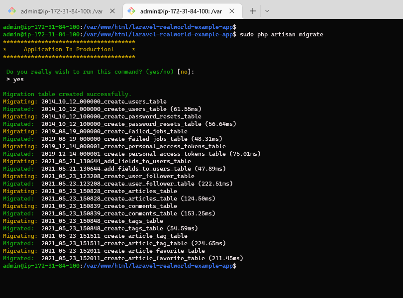

At this point, we can now access our laravel application through the URL http://AWS-public-ip

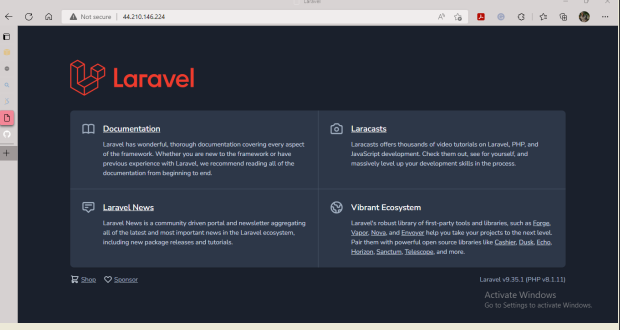
