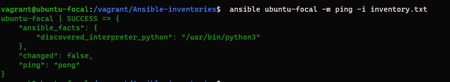
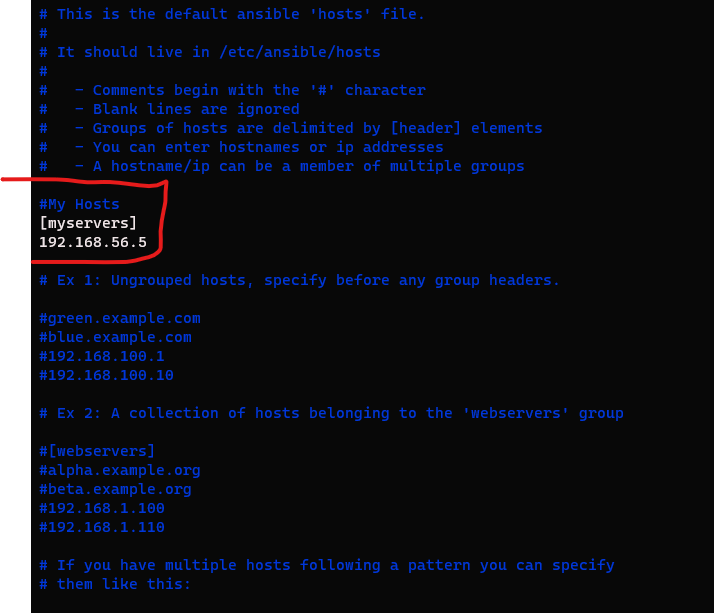

## SETS TO SETUP ANSIBLE HOSTS NAMES USING "MASTER and SLAVE(s)"

Assuming master and slave(s) is **already** configured properly either through a cloud service provider e.g AWS **OR** locally on your Desktop(two or more VMs)...

**THEN:**

**NOTE:: ALL SETS MUST BE DONE IN MASTER ONLY**

**Step 1: Download Ansible on MASTER**

$ sudo apt uppdate -y && apt upgrade -y && apt install ansible -y

**Step 2: Verify installation**

$ ansible --version

**Step 3: Creating the test inventory file**

**NOTE:** On your Exercise-7...

$ vi inventory.txt

**\_Edit file as followed using the IP address of your **SLAVE**\_**

========================================================

ubuntu-focal ansible_host=192.168.56.5 ansible_connection=ssh ansible_user=vagrant

========================================================

Quit and Save with :wq.

**Step 4: Execute the file**

$ ansible ubuntu-focal -m ping -i inventory.txt

**_Expected output_**

**Step 5: Edit your web hosts**

$ sudo vi etc/ansible/host

Define your Hosts using the IP address(es) of your **SLAVE(s)**

**The host name **(myservers)** will be used in ansible playbook**

Quit and Save with :wq.
